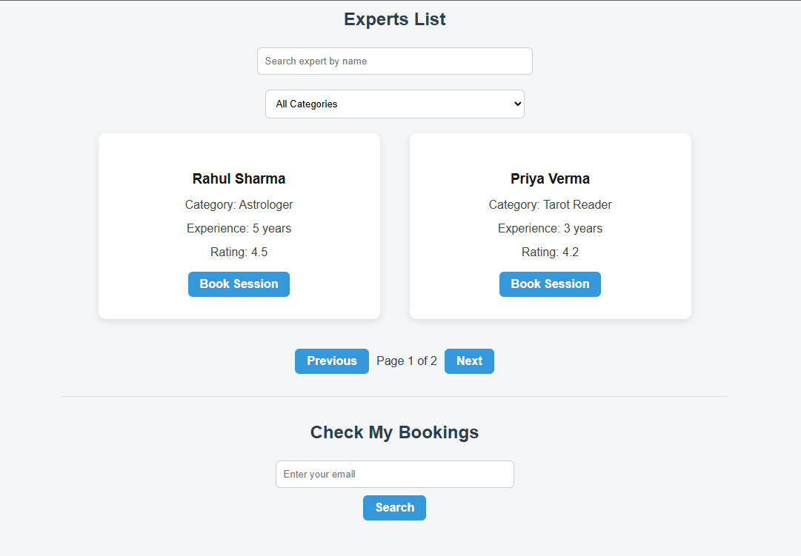
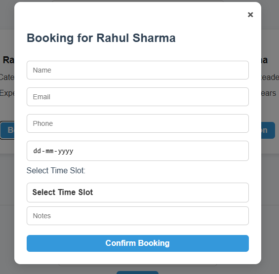
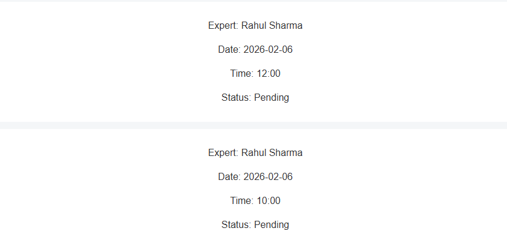

# Expert Booking System

A full-stack Expert Session Booking System built using React, Node.js, Express, and MongoDB.

## Features

- View expert list
- Search experts by name
- Filter experts by category
- Pagination support
- Book expert sessions
- Disable already booked time slots
- Form validation
- View bookings by email
- MongoDB database integration

## Screenshots

### Expert List

### Booking Modal

### My Bookings

## Tech Stack

Frontend:
- React
- CSS

Backend:
- Node.js
- Express

Database:
- MongoDB Atlas
- Mongoose

## Installation

Clone repository:

git clone https://github.com/itzz-ryut/expert-booking-system.git

Backend setup:

cd backend  
npm install  
node server.js  

Frontend setup:

cd frontend  
npm install  
npm run dev  

## API Endpoints

GET /experts  
GET /bookings  
POST /bookings  

## Author

Aryan Kumar